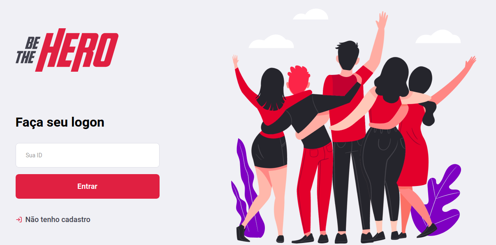

# beTheHero
<h4 align="center">
 
 <b>Seja um verdadeiro Heroi!</b> 🦸‍♂️
</h4>

# Be The Hero
Be The Hero é um projeto que consiste em uma aplicação web e mobile, que visa uma plataforma de ajuda financeira para instituições de caridade. A plataforma conta com uma ferramenta de cadastro de ONGs e de casos via web, assim como um aplicativo para dispositivos mobile que permite que heróis apadrinhem os casos previamente cadastrados.

## :page_with_curl: Sobre o projeto
Esse projeto foi desenvolvimento durante a Semana OmniStack 11, um evento promovido pela Rocketseat (https://rocketseat.com.br), onde construimos uma aplicação completa com base no Node.js, ReactJS e React Native.

## :rocket: Tecnologias usadas

Esse projeto foi desenvolvido com as seguintes tecnologias:

#### Backend
* Node.js (https://nodejs.org)
* Express (https://expressjs.com)

#### Frontend
* React (https://reactjs.org)
* Axios (https://github.com/axios/axios)

#### Mobile
* React Native (https://reactnative.dev)
* Expo (https://expo.io)

#### Database
* SQLite (https://www.sqlite.org/index.html)
* Knex (http://knexjs.org)

## Screenshots

#### Web - Logon

#### Web - Cadastro de ONG

#### Web - Listagem de casos

#### Web - Cadastro de caso

<table>
	<tr>
		<th width="33.3%">
			App splash screen 
		</th>
		<th width="33.3%">
			App incident list
		</th>
    <th width="33.3%">
			App incident detail
		</th>
	</tr>
	<tr><!-- Prevent zebra stripes --></tr>
	<tr>
		<td>
			
		</td>
		<td>
			
		</td>
    <td>
			
		</td>
	</tr>
</table>
